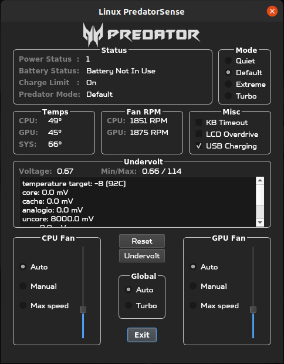

## PredatorSense™ clone for ```PH315-54-760S```
### Controls fan speed, gaming modes and undervolting on Linux. This application is intended for Acer Predator Helios 300 (2021) model



## Disclaimer:
* Secure Boot is **not** supported.
* Using this application with other laptops may potentially damage them. Proceed at your discretion.

## Usage:
- ```sudo``` is required in order to access the Super I/O EC registers and apply undervolt offsets

- First make sure to set the ```UNDERVOLT_PATH``` in ```main.py``` to the appropriate location of the undervolt package
  - If you installed without sudo you can find where undervolt is located by doing
    ```
    which undervolt
    ```
  - Next set ```COREOFFSET``` and ```CACHEOFFSET``` to the mV that you determined to be stable via throttlestop on windows

 - From the command line you can run the main script as root:
```
sudo python main.py
```

### Alternatively you can copy the .desktop file to your applications folder and launch it via it's icon

You will need to update these 2 lines first to point to the correct program directory
 - Set <path_to_PredatorSense> to the directory where you downloaded this project
```
Exec=sh -c "pkexec env DISPLAY=$DISPLAY XAUTHORITY=$XAUTHORITY sh -c 'cd <path_to_PredatorSense> && python3 main.py'"
Icon=<path_to_PredatorSense>/app_icon.ico
```
 - Copy the file to the application directory

```
sudo cp predator-sense.desktop /usr/share/applications/
```
 - Now launch via the application and on initialization it will prompt for the user password

## Dependencies:
* Ubuntu / Linux Mint:
```
sudo apt install python3-pip
pip install qtpy
pip install git+https://github.com/georgewhewell/undervolt.git
sudo apt-get install msr-tools
```

Packages:
* ```Python Qt5``` -> [PyQt5](https://pypi.org/project/PyQt5/)
* ```undervolt``` -> [Undervolt by georgewhewell](https://github.com/georgewhewell/undervolt)
* ```msr-tools``` -> [msr-tools by intel](https://github.com/intel/msr-tools)

## This is a fork of [PredatorSense by mohsunb](https://github.com/mohsunb/PredatorSense), customized for ```PH315-54```

## Changelog:
Dec 22
- Completely overhauled the UI
  - Added new Dialogs for fan speed, temperatures, modes, undervolting and miscellaneous
  - Created a new screenshot to showcase the updated interface
- Updated app icon to blue predator logo (originally red)
- Created a new class for accessing EC registers
  - Close file handle on shutdown
- Created a timer to periodically update the UI
- Created toggle for LCD Overdrive
- Created toggle for USB charging
- New function to check the current VCORE voltage and record max/min
- New functions to undervolt CPU
- New function to query battery charge limit
- New function to query predator mode
- New function to read fan speed
- Lots of refactoring
