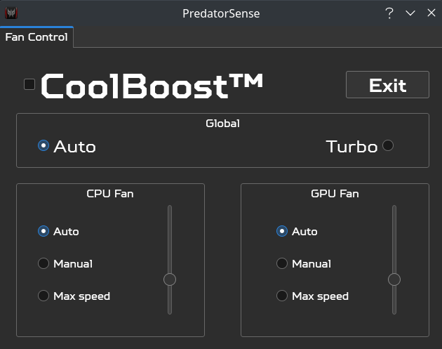

## Predator Sense™ clone for ```PH315-51-78NP``` to control fan speed on Linux. This application is intended for "Acer Predator Helios 300", 2018 model.


## Disclaimer:
* Secure Boot is **not** supported.
* Using this application with other laptops may potentially damage them. Proceed at your discretion. Though it most likely works with other **Acer Predator Helios 300** models.
* It does **not** work with OpenBSD's root access command port, ```opendoas```. Use ```sudo``` instead when running through a terminal.
* Application may fail to launch the first time. Opening it again will fix it.
* Dropped support for Fedora as it ships the kernel without the necessary ```ec_sys``` module enabled. You can, of course, recompile the kernel yourself. But at that point it is probably better to switch to another distro, like Arch. ;)
## Usage: (Ubuntu, Linux Mint, Arch Linux)
```
git clone https://github.com/mohsunb/PredatorSense.git
```
```
cd PredatorSense
```
```
sudo ./install.sh
```
```
predator-sense
```
... or use the desktop entry.

## This is a fork of [PredatorNonSense by kphanipavan](https://github.com/kphanipavan/PredatorNonSense), customized for ```PH315-51```.

## Changes:
* Added custom font (TT Squares);
* Removed dysfunctional tabs (keyboard lighting settings, fan profiles, GPU overclock);
* Added dark theme;
* Added custom icon;
* Made the window not resizeable;
* General UI improvements;
* Refactored the code for easier maintenance;
* Dynamically disabled buttons to prevent unexpected behavior;
* Global fan state is now remembered across sessions;
